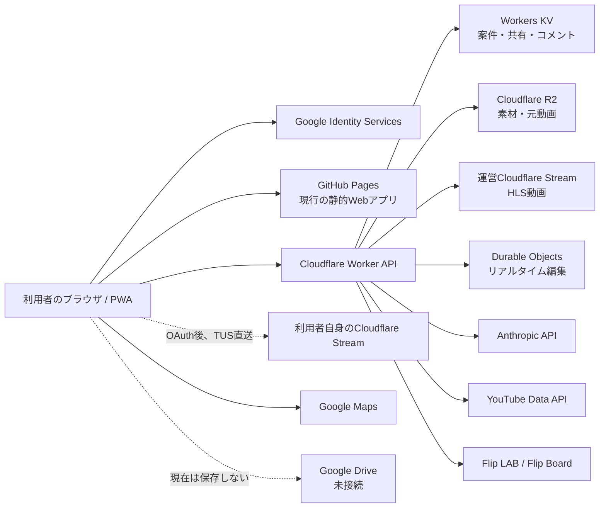
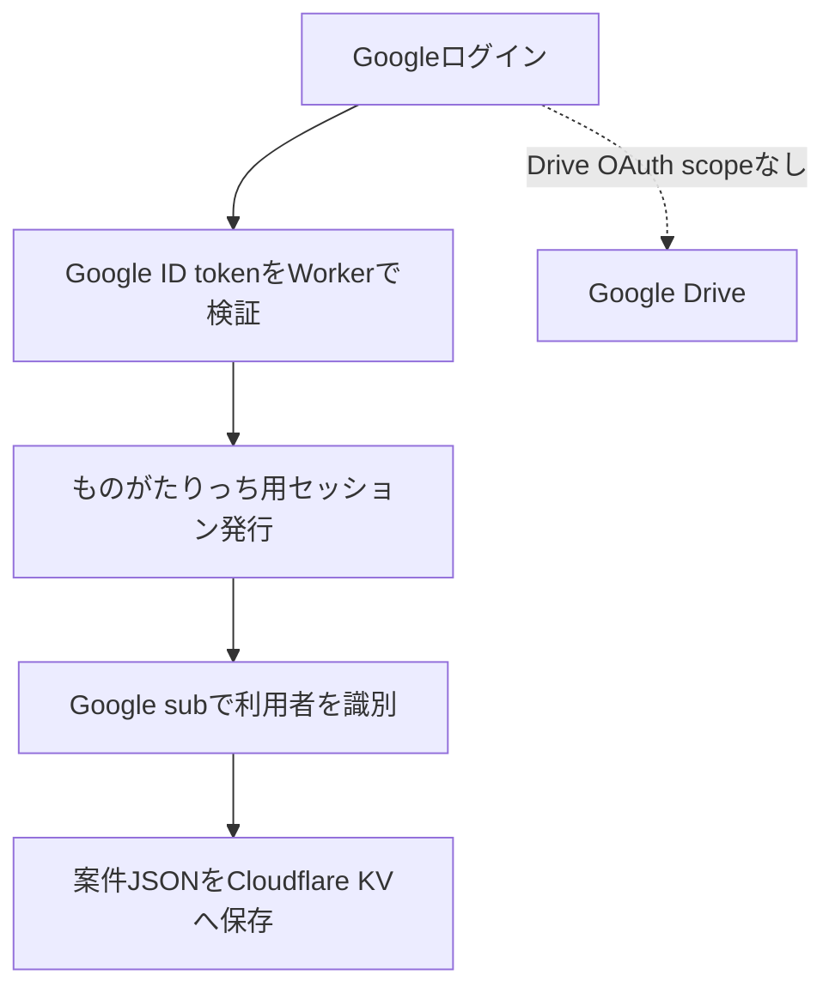
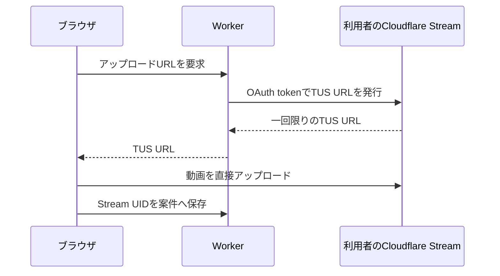
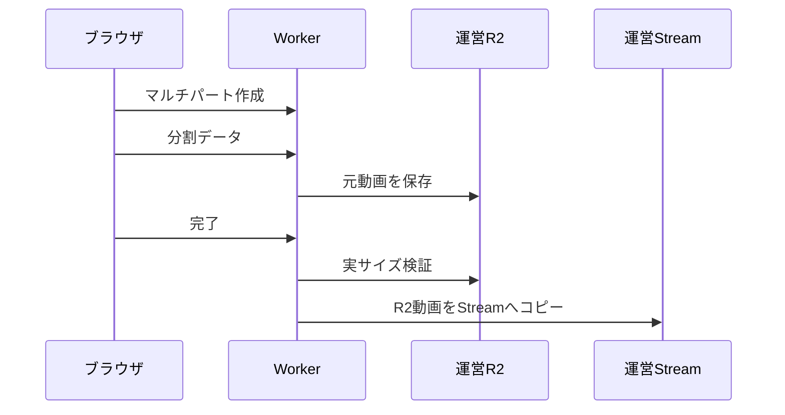

# ものがたりっち システム構成・連携一覧

更新日: 2026-07-29

## 1. 全体構成

## 2. ログインと保存

重要:

- Googleログインは本人確認に使う。
- Google Driveの読み書き権限は取得していない。
- 「クラウド同期」の現在の保存先はCloudflare KVである。

## 3. 動画アップロード

### 3.1 利用者自身のStream接続時

この経路では動画本体が運営R2を経由せず、保存容量とStream費用は利用者側となる。

### 3.2 運営基盤を使う従来経路

一般利用者をこの経路へ暗黙フォールバックさせないことが現在の方針である。

## 4. 接続先と費用負担

| 接続先 | 用途 | データ | 費用負担 |
|---|---|---|---|
| Google Identity | 本人確認 | ID token、基本プロフィール | 運営設定 |
| Cloudflare KV | 案件同期 | 案件JSON、共有、コメント | 運営 |
| Cloudflare R2 | 素材・元動画 | ファイル本体 | 運営 |
| 運営Stream | HLS変換 | 確認動画 | 運営 |
| 利用者Stream | HLS変換 | 接続利用者の確認動画 | 利用者 |
| Durable Objects | 共同編集 | ライブ文書状態 | 運営 |
| Anthropic | AI | 入力テキスト、案件情報 | 現在は運営 |
| YouTube Data API | 調査 | 動画ID、検索語 | 現在は運営 |
| Google Maps | 場所 | 住所、座標 | 運営設定 |
| Flip LAB／Board | 制作進行 | 案件ID、工程、ルール | 運営 |
| Google Drive | 将来保存 | 現在なし | 未定 |

## 5. 認証・権限の種類

| 種類 | 用途 |
|---|---|
| Google ID token | ログイン時の本人確認 |
| ものがたりっち session token | ログイン後API |
| 共有閲覧token | 共有スナップの更新・管理 |
| live編集token | Durable Objectの共同編集 |
| upload capability | R2マルチパートの期限付き権限 |
| Cloudflare OAuth token | 利用者自身のStream操作 |
| Worker secrets | Anthropic、YouTube、署名鍵等 |

## 6. 公開前のシステム課題

| 優先度 | 課題 |
|---|---|
| P0 | AI APIのログイン必須化と利用者別上限 |
| P0 | 利用者別の保存量・アップロード量計測 |
| P0 | ゲストアップロードの明示許可制 |
| P0 | 管理者の緊急停止スイッチ |
| P1 | セッションをHttpOnly Cookieへ移行 |
| P1 | アカウント削除・データエクスポート |
| P1 | 保存先・保持期限・費用負担の表示 |
| P1 | 利用者別AIキーの暗号化保存 |
| P2 | Google Drive連携 |
| P2 | 監視、メトリクス、障害通知 |

## 7. 関連資料

- [機能一覧](FEATURE_CATALOG.md)
- [要件定義書](REQUIREMENTS.md)
- [共有前の構成監査](../ARCHITECTURE_AUDIT.md)
- [Cloudflare OAuth設定](../CLOUDFLARE_OAUTH_SETUP.md)
